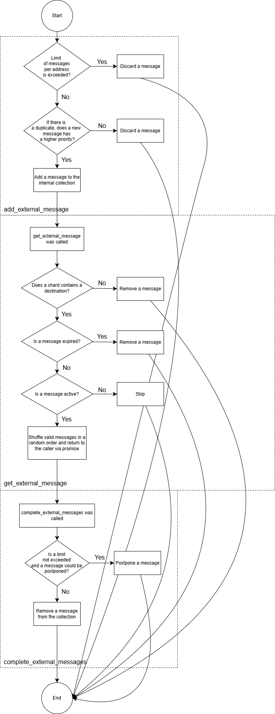

## Methods
| Method Name | Description |
|--|--|
| `new_external_message` | This method performs a basic validation, creates an external message and adds it to the collection. This method checks if:  - Validator has started  - Validator is ready to process a message  - Limit of external messages is not exceeded  - `create_ext_message` successfully constructed a message If those conditions are met, a new external message will be added to the map with a given priority via `add_external_message`.|
| `add_external_message` | This method adds a new external message to the collection. A message will not be added if: - The number of messages for the provided address has already reached the allowed limit - A message with the same ID already exists, and the priority of the existing message is greater or equal to the priority of the new message.|
| `get_external_messages` | This method extracts external messages from the collection, filter them, shuffle valid messages and returns them via promise. If a message is expired, it will be removed from the collection. If the destination address of a message is outside the scope of the given shard, the processing of messages with the current priority will be halted.|
| `complete_external_message` | This method deletes and delays external messages by hash. Messages whose hashes are listed in the `to_delete` will be removed. Messages whose hashes are listed in the `to_delay` will be postponed if the number of messages does not exceed `soft_mempool_limit` and message can be postponed. Otherwise, the message will be removed.|
| `send_external_message` | This method sends an external message to a shard via the callback handler and adds it to the local collection with the lowest priority via `add_external_message` method. |
| `check_external_message` | This method validates incoming external messages. This method:  - Checks if liteserver is ready  - Creates external message from raw data  - Limits the number of messages allowed for a specific address  - Validates a message via `run_check_external_message` If some error has occurred, it will be reported via promise.|

## Flow Analysis
### Entry point
An external message enters the manager.cpp context via `send_external_message` method if `check_external_message` has successfully validated a message [\[1\]](https://github.com/ton-blockchain/ton/blob/7151ff26279fef6dcfa1f47fc0c5b63677ae2458/validator/impl/liteserver.cpp#L555C1-L574C2).
### Processing Flow
An external message will be saved to the collection inside ValidatorManager via `add_external_message` [\[2\]](https://github.com/ton-blockchain/ton/blob/7151ff26279fef6dcfa1f47fc0c5b63677ae2458/validator/manager.cpp#L1602) in case of successful validation by this method.
A list of active internal messages could be retrieved from ValidatorManager through the call of `get_external_messages` and used for further processing.
External messages could be removed from ValidatorManager or postponed (if possible) via `complete_external_message`.

### Forward/Outcome
An external message which has been added to the collection of ValidatorManager could be discarded in the process of execution `get_external_messages` method (those cases highlighted in the description).
A list of messages retrieved from `get_external_messages` could be used by the caller for further processing of messages [\[3\]](https://github.com/ton-blockchain/ton/blob/7151ff26279fef6dcfa1f47fc0c5b63677ae2458/validator/impl/collator.cpp#L270C1-L278C4). But obtained messages still will be inside the collection. They could be removed from it via `complete_external_message` method.

## Diagram
